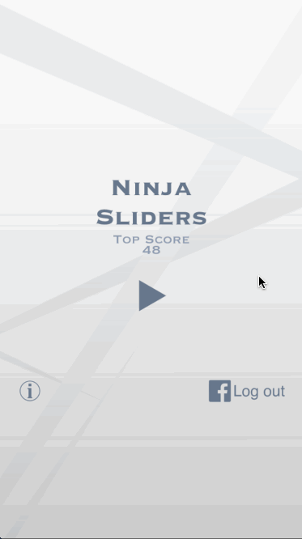
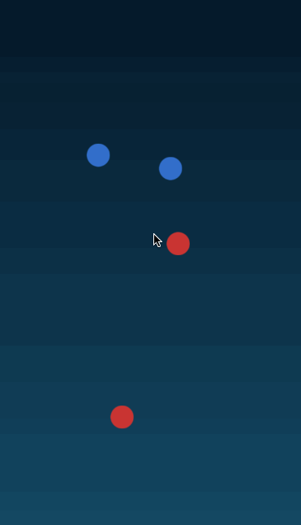

# SpriteBuilderSliders
Game developed in SpriteBuilder for the Mobile Game Development class.

Objective (Goal)
----------------
Destroy all enemies by making your soldiers pass through them.

Mechanics
---------
Touch any point in the screen to make your soldiers move to that point. Your soldiers will pass through each other, so if you have 2 soldiers, they will move to the point you touched and keep moving forward for a while, so they'll form an X.

Final Demo Preview
------------------

First Demo Preview
------------------

More Info
---------

For more info, read the wiki:
https://github.com/marilu597/SpriteBuilderSliders/wiki
